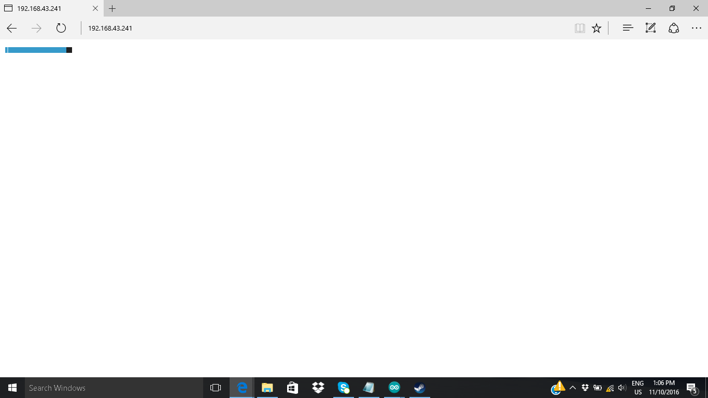

# Controle de Cargas via WI-FI

O presente repositório está para exposição do projeto Controle de Cargas via WI-FI, apresentado sobre a Participação na 26ª Mostra Específica de Trabalhos e Aplicações (META), que ocorreu do dia 9 ao dia 12 de novembro de 2016, no Expo Minas durante a FINIT.

A META, desde sua concepção em 1978, se propõe a divulgar as pesquisas desenvolvidas por professores e alunos dos cursos técnicos e de graduação, à comunidade e visitantes de outras instituições educacionais e/ou empresariais.Como um espaço para desenvolver metodologia de projetos, a Mostra oferece aos professores e alunos oportunidade para diversificar as atividades de aprendizagem, com ações de caráter prático e aplicado.

O projeto “Controle de Cargas via Wi-Fi” é um projeto que visa fazer um protótipo de automação residencial, controlado através de um computador ou smartphone conectado à internet ou diretamente à carga, dependendo da distância.

A interação online é feita à partir de um webserver, criado em linguagem HTML, linguagem universal para websites. Este servidor interage com o usuário com a sua escolha, enviando comandos de resposta para um módulo Wi-Fi ESP8266, que fará a interpretação e atuará no circuito.

  

    
  
 

O projeto pode ser aplicado em circuitos elétricos caseiros, como lâmpadas, ventiladores, persianas, janelas motorizadas, entre outros, de acordo com a adaptação da programação. Como os alunos visam apresentar apenas a ideia, a carga de acionamento utilizada será uma lâmpada, ajustando a sua intensidade luminosa de acordo com o comando do usuàrio.
